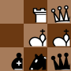
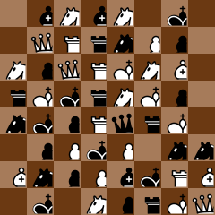
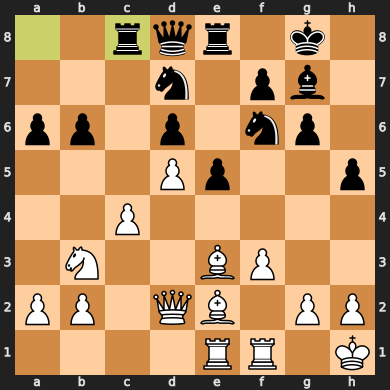
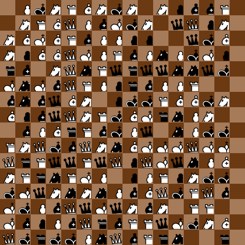
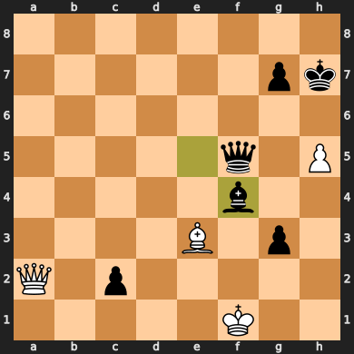
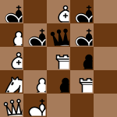
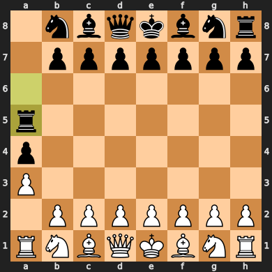
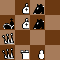
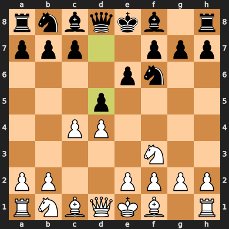
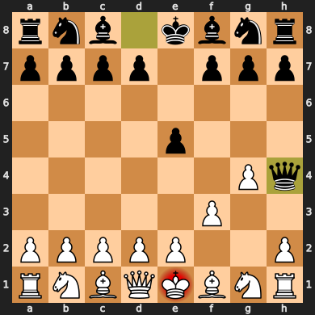

# Chess Visual Code

A simple project that started with the idea of "chess QR codes".



## Installation / Usage

This project uses [uv](https://docs.astral.sh/uv/) for dependency management. Check `pyproject.toml` for details.

Run the example code with `uv run python main.py`.

## How it works

The objective of this project is to be able to pack an entire chess game (e.g., in pgn form) into a visual code (inspired by QR codes) made of chess pieces on a (non-standard size) chess board.

There are two different problems to solve:

1. How to encode the information
2. How to display the code

### 1. Encoding details

All pieces (8 white, 8 black) plus blank spaces are used in the code, giving us 13 choices for each square, i.e., a base-13 number.

Steps:
1. For every ply:
   1. Compute the list of available moves sorted alphabetically by UCI
      * Example for initial board state: `a2a3,a2a4,b1a3,b1c3,b2b3,b2b4,c2c3,c2c4,d2d3,d2d4,e2e3,e2e4,f2f3,f2f4,g1f3,g1h3,g2g3,g2g4,h2h3,h2h4`
   2. Add the move *index* to the code, zero padding to the number of digits required (base 10 used here)
      * Example for `1. d4`: `09`
      * Number of digits is calculated from the list of available moves (<= 10, 1 digit; > 10 and <= 100, 2 digits; etc)
2. Convert the resulting string of numbers into a base-13 number
   * It is likely that the string of move indexes starts with a string of zeros, that are lost when converting to an integer.
   * To solve it, append the number of zeros (in base-13) to the start of the base-13 number
   * To keep the decoding simple, the number of zeros is fixed at 2 digits (base-13), i.e., a maximum of 169 zeros in a row (~ 80 plies)
   * 14 0-index plies in a row can be claimed as a draw by repetition, and 22 plies is a forced draw (5-fold repetition)
   * `1. a3 a5 2. Ra2 a4 3. Ra1 Ra5 4. Ra2 Ra6 5. Ra1 Ra5 6. Ra2 Ra6 7. Ra1 Ra5 8. Ra2 Ra6 9. Ra1 Ra5 10. Ra2 Ra6 11. Ra1 Ra5`
3. Convert the base-13 number into a string of pieces
   * Order of pieces is `0kKqQrRbBnNpP`
* Example for `1. d4 Nf6 2. c4 e6 3. Nf3 d5`:
  1. Move string: `091613112408`
  2. Base-13 number: `884009946C`
  3. Number of zeros in base-13: `01`
  4. Number string with zeros: `01884009946C`
  5. Pieces string: `0kBBQ00nnQRP`
  6. Image can be found in [Examples](#examples)

To save space, instead of using a move string or similar, for every ply

### 2. Display details

* Only square boards were used
* The size of the board depends on the number of digits of the base-13 number, i.e., it's always the smallest possible square board that fits the code
  * Examples: 4 digits: 2x2, 15 digits: 4x4, 55 digits: 8x8, etc
* To keep consistency, the ordering of the code symbols on the board is not row or column based:
  * every new level wraps around the existing square, starting at the bottom left, going right then up, ending at the top right
  * 2x2 goes
    ```
    1 4
    2 3
    ```
  * 3x3 goes
    ```
    1 4 9
    2 3 8
    5 6 7
    ```
  * and so on
* This does not necessarily guarantee that taking a subset of the board from the top left is a valid code, as a position indexes may be split between levels 

## Features

Available:

* Encode: pgn ⇒ code
* Decode: code ⇒ pgn
* Draw: code ⇒ chessboard

Missing:

* Scan: chessboard ⇒ code

## Examples

Examples show the code on the left and the final position on the right.

<details>
<summary>16 moves in a Sicilian game to give a 8x8 board</summary>


</details>

<details>
<summary>2023 World Chess Championship Game 18</summary>


</details>

<details>
<summary>22 0-index plies in a row</summary>


</details>

<details>
<summary>Example used for the explanation above</summary>


</details>

<details>
<summary>Fool's mate</summary>


</details>

## Acknowledgments

Chess pieces' SVG files from [Wikimedia](https://commons.wikimedia.org/wiki/Category:SVG_chess_pieces).
